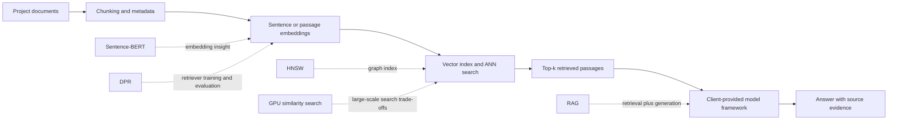

# Vector Retrieval and RAG Literature Review

**Project:** Southern-cross AI / JoeyLLM  
**Sprint / Week:** Sprint 4 / Week 3  
**Research completed:** 10 August 2026  
**Last reviewed:** 10 August 2026  
**Status:** Sprint 4 literature review complete; retrieval implementation and benchmark not claimed

> This document records Sprint 4 Week 3 research evidence for the Qdrant and retrieval workstream. It does not claim that an embedding model, vector collection, retrieval pipeline, RAG system, or production benchmark has been implemented.

## 1. Research question

How should the team evaluate the document-to-answer retrieval pipeline around the client-provided JoeyLLM framework, with particular attention to dataset preparation, embedding choice, approximate nearest-neighbour search, retrieval quality, and generation grounded in retrieved evidence?

The five papers reviewed this week cover complementary layers of that pipeline:

## 2. Paper summary

| # | Paper | Main contribution | Relevance to the project | Important limitation |
| --- | --- | --- | --- | --- |
| 1 | Reimers and Gurevych (2019), *Sentence-BERT* | Uses siamese or triplet BERT structures to produce fixed-size sentence embeddings that can be compared efficiently with cosine similarity. | Explains why an embedding model is needed before documents and queries can be stored and compared in Qdrant. | The paper does not establish that SBERT is the best model for JoeyLLM data, current multilingual needs, or the client's framework. |
| 2 | Karpukhin et al. (2020), *Dense Passage Retrieval* | Uses separate question and passage encoders, dot-product scoring, in-batch negatives, and hard negatives for open-domain QA retrieval. | Provides a model for evaluating passage retrieval separately from answer generation and highlights the value of negative examples. | Reported gains are from the paper's QA datasets and cannot be transferred directly to the JoeyLLM corpus. |
| 3 | Malkov and Yashunin (2016/2018), *HNSW* | Builds a multi-layer proximity graph for approximate nearest-neighbour search with strong recall/latency behaviour and incremental indexing. | Provides the algorithmic basis for understanding Qdrant's dense-vector index and its main tuning trade-offs. | Approximate search introduces recall, memory, construction-time, and query-latency trade-offs; no parameter values are automatically correct for this project. |
| 4 | Johnson, Douze, and Jegou (2017/2019), *Billion-scale Similarity Search with GPUs* | Presents GPU-optimised exact and approximate similarity search, including k-selection and product quantisation, implemented in Faiss. | Shows how hardware, quantisation, memory, accuracy, and scale affect vector search. | It studies Faiss and very large GPU workloads, not the current Qdrant deployment. It is a large-scale reference, not evidence that GPU indexing is currently required. |
| 5 | Lewis et al. (2020), *Retrieval-Augmented Generation* | Combines a parametric sequence-to-sequence model with non-parametric dense retrieval and compares RAG-Sequence with RAG-Token. | Supplies the conceptual architecture for retrieving evidence before using the client-provided model to generate an answer. | RAG improves results in the reported tasks but does not guarantee factuality, correct citations, or suitability for the JoeyLLM dataset. |

## 3. Detailed findings

### 3.1 Sentence-BERT: sentence-level embeddings

The original BERT cross-encoder processes a pair of sentences together. That can be accurate for pairwise comparison but is unsuitable for repeatedly searching a large corpus because every query-document pair must be evaluated. Sentence-BERT instead produces reusable fixed-size embeddings. The paper reports reducing one 10,000-sentence similarity task from about 65 hours with pairwise BERT/RoBERTa comparison to about five seconds while maintaining comparable task accuracy.

**Project implication:** document chunks can be embedded once and stored, while each incoming question is embedded at query time. The embedding model determines vector dimensions and influences the correct similarity metric, so the Qdrant collection must not be finalised before the model is agreed with the client.

### 3.2 Dense Passage Retrieval: learning retrieval for QA

DPR encodes questions and passages independently and scores them with an inner product. Its training design reuses other positive passages in a mini-batch as negatives and adds a BM25-retrieved hard negative. On the paper's open-domain QA benchmarks, DPR improved top-20 passage retrieval accuracy by 9-19 absolute percentage points over its Lucene-BM25 baseline.

**Project implication:** retrieval must be evaluated before generation. A useful JoeyLLM evaluation set should contain queries, relevant passages, and challenging non-relevant passages. If the team later trains or fine-tunes a retriever, negative-example construction is a first-class dataset decision rather than only a model parameter.

### 3.3 HNSW: approximate nearest-neighbour indexing

HNSW organises vectors in a hierarchy of proximity graphs. Search starts in sparse upper layers and moves towards denser lower layers. The paper describes a logarithmic-scaling objective and demonstrates strong recall/speed results across multiple datasets, while also acknowledging additional memory use and distributed-search challenges.

For Qdrant, the relevant controls include:

- `m`: graph connectivity and therefore memory/build/search trade-offs;
- `ef_construct`: candidate-list size during index construction;
- `hnsw_ef`: candidate-list size at query time;
- exact search: a brute-force reference for measuring approximate-search recall on a manageable evaluation set.

**Project implication:** HNSW settings should be benchmarked rather than copied from the paper or a tutorial. The team should measure Recall@k against an exact-search reference together with latency, memory, and build time.

The parameter mapping above was checked against Qdrant's current [indexing documentation](https://qdrant.tech/documentation/manage-data/indexing/) and [ANN recall guide](https://qdrant.tech/documentation/tutorials-search-engineering/ann-recall/). Collection vector size and distance metric requirements are documented separately in Qdrant's [collections documentation](https://qdrant.tech/documentation/manage-data/collections/).

### 3.4 GPU similarity search and product quantisation

Johnson et al. optimise similarity search for GPU execution and introduce a high-performance k-selection design. Their implementation covers brute-force search, approximate search, and compressed search using product quantisation. The paper reports large-scale examples, including a graph over one billion vectors built in under 12 hours on four Maxwell Titan X GPUs.

**Project implication:** GPU acceleration and quantisation are possible responses to a demonstrated scale or latency problem. They should not be Sprint defaults. The team first needs corpus-size estimates and CPU/Qdrant baselines; only then can it justify compression or specialist GPU indexing.

### 3.5 RAG: combining retrieval and generation

Lewis et al. combine a pre-trained retriever and dense document index with a sequence-to-sequence generator. RAG-Sequence uses the same retrieved-document latent variable across the generated sequence, whereas RAG-Token can condition different tokens on different retrieved documents. The paper reports stronger results than its parametric-only baseline on several knowledge-intensive tasks and shows that the external index can be replaced without retraining the full generator.

**Project implication:** the knowledge base should be treated as an independently maintainable dataset. A retrieval-enabled interface should preserve the relationship between an answer and its retrieved evidence. It should also distinguish a successful retrieval with no relevant result from a failed request. Retrieval improves access to evidence, but the project still needs explicit groundedness and citation checks.

## 4. Combined design implications

The papers support the following tentative architecture, subject to the client API contract:

1. Prepare an approved document corpus with stable identifiers, source titles, dates, permissions, and update metadata.
2. Test chunking rules rather than treating chunk size and overlap as fixed conventions.
3. Generate document and query embeddings with the same client-approved embedding model.
4. Create a Qdrant collection whose vector size and distance metric match that model.
5. Store source metadata in the point payload so retrieved passages can be traced to original documents.
6. Retrieve top-k candidates and evaluate retrieval independently.
7. Pass only the required evidence to the client-provided model framework.
8. Return answers together with source information and explicit no-results/error states.

This is a research-informed proposal, not a confirmed production design.

## 5. Evaluation requirements identified during Sprint 4

### 5.1 Questions that must be confirmed with the client

- Which embedding model and version will be used?
- What vector dimension and similarity metric does that model require?
- Which documents may be indexed, and what access restrictions apply?
- Where will Qdrant be hosted and who owns its configuration?
- Will retrieval be orchestrated by the team's application layer or inside the client-provided model service?
- What request/response fields will carry retrieved text, source metadata, and errors?
- What latency, quality, storage, and security constraints define success?

### 5.2 Controlled variables

| Layer | Variables to compare | Evidence to record |
| --- | --- | --- |
| Dataset | document selection, cleaning, deduplication, chunk size, overlap, metadata completeness | corpus version, point count, token/chunk distribution, rejected items |
| Embedding | approved model candidates and any required normalisation | model/version, dimension, encoding time, retrieval metrics |
| Retrieval | dense baseline, optional sparse or hybrid baseline, top-k, metadata filters | Recall@k, MRR or nDCG where labels allow, latency, failure cases |
| HNSW | `m`, `ef_construct`, `hnsw_ef` | build time, memory, query latency, ANN recall against exact search |
| Answering | prompt/context selection within the client framework | answer groundedness, source correctness, unsupported claims, no-result behaviour |

### 5.3 Minimum reproducible research evidence

The team concluded that any valid retrieval experiment must record:

- corpus snapshot and preprocessing rules;
- embedding model name, version, dimensions, and distance metric;
- Qdrant version and collection configuration;
- deterministic test queries with expected relevant documents;
- exact and approximate retrieval outputs;
- metrics plus observed failure cases;
- commands or notebook steps required to repeat the test;
- clear separation between measured results and identified evaluation requirements.

Until such an artefact exists, the accurate status remains **research complete; retrieval implementation and benchmark pending**.

## 6. What the literature does not establish

These papers do **not** by themselves prove that:

- Qdrant is the only or best vector store for the project;
- one particular embedding model is suitable for the client corpus;
- dense retrieval will outperform a sparse or hybrid baseline on JoeyLLM data;
- a copied HNSW configuration will meet the project's latency and recall targets;
- GPU search or product quantisation is currently necessary;
- retrieved evidence guarantees a factual or correctly cited answer;
- any live model, API, Qdrant collection, or RAG pipeline is already implemented.

## 7. References

1. Reimers, N., and Gurevych, I. (2019). [Sentence-BERT: Sentence Embeddings using Siamese BERT-Networks](https://aclanthology.org/D19-1410/). EMNLP-IJCNLP 2019. DOI: `10.18653/v1/D19-1410`.
2. Karpukhin, V., et al. (2020). [Dense Passage Retrieval for Open-Domain Question Answering](https://aclanthology.org/2020.emnlp-main.550/). EMNLP 2020. DOI: `10.18653/v1/2020.emnlp-main.550`.
3. Malkov, Y. A., and Yashunin, D. A. (2018). [Efficient and Robust Approximate Nearest Neighbor Search Using Hierarchical Navigable Small World Graphs](https://arxiv.org/abs/1603.09320). *IEEE Transactions on Pattern Analysis and Machine Intelligence*, 42(4), 824-836. DOI: `10.1109/TPAMI.2018.2889473`.
4. Johnson, J., Douze, M., and Jegou, H. (2019). [Billion-scale Similarity Search with GPUs](https://arxiv.org/abs/1702.08734). *IEEE Transactions on Big Data*, 7(3), 535-547. DOI: `10.1109/TBDATA.2019.2921572`.
5. Lewis, P., et al. (2020). [Retrieval-Augmented Generation for Knowledge-Intensive NLP Tasks](https://proceedings.neurips.cc/paper/2020/hash/6b493230205f780e1bc26945df7481e5-Abstract.html). NeurIPS 2020.

## 8. Source-management note

The team reviewed local copies of the five papers during Week 3. The third-party PDF binaries are not duplicated in this public repository. The authoritative ACL Anthology, arXiv, IEEE, and NeurIPS links in the reference list provide the reviewable publication sources while avoiding unsupported redistribution of the papers.
